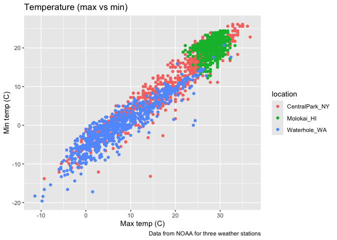
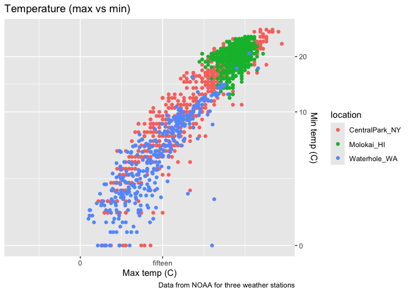
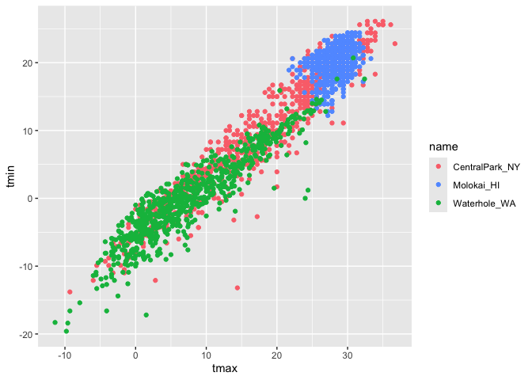
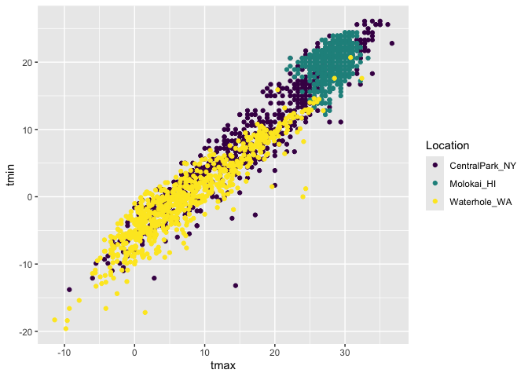

20271006_visualization
================
Hongtong Lin
2026-10-06

loading libraries

``` r
library(tidyverse)

library(p8105.datasets)
data("weather_df")
```

``` r
weather_df |> 
  ggplot(aes(x= tmax, y = tmin, color = name)) + 
  geom_point()+
  labs(
    title = "Temperature (max vs min)",
    x = "Max temp (C)",
    y = "Min temp (C)",
    color = "location",
    caption = "Data from NOAA for three weather stations"
  )
```

<!-- -->

Try some other scales

``` r
weather_df |> 
  ggplot(aes(x= tmax, y = tmin, color = name)) + 
  geom_point()+
  labs(
    title = "Temperature (max vs min)",
    x = "Max temp (C)",
    y = "Min temp (C)",
    color = "location",
    caption = "Data from NOAA for three weather stations"
  ) +
  scale_x_continuous(  # controls how a continuous x-axis looks and behave
    breaks = c(-15, 0, 15),
    labels = c("-10C", "0", "fifteen")
  ) + 
  scale_y_continuous(
    trans = "sqrt",
    position = "right"
  )
```

    ## Warning in transformation$transform(x): NaNs produced

    ## Warning in scale_y_continuous(trans = "sqrt", position = "right"): sqrt
    ## transformation introduced infinite values.

    ## Warning: Removed 520 rows containing missing values or values outside the scale range
    ## (`geom_point()`).

<!-- -->

let’s look at color

``` r
weather_df |> 
  ggplot(aes(x = tmax, y=tmin, color = name)) +
  geom_point() +
  scale_color_hue(h = c(10, 500))
```

    ## Warning: Removed 17 rows containing missing values or values outside the scale range
    ## (`geom_point()`).

<!-- -->

``` r
weather_df |> 
  ggplot(aes(x = tmax, y=tmin, color = name)) +
  geom_point() +
  viridis::scale_color_viridis( # can put it in the global setting
    name = "Location",
    discrete = TRUE # has to add this because i'm dealing with a continuous scale, but the categories are discrete values/levels
  )
```

    ## Warning: Removed 17 rows containing missing values or values outside the scale range
    ## (`geom_point()`).

<!-- -->
