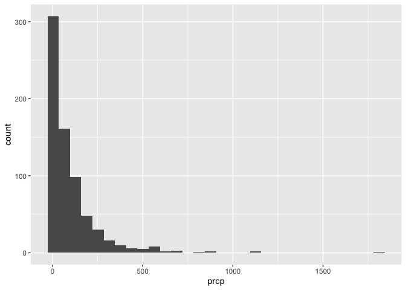
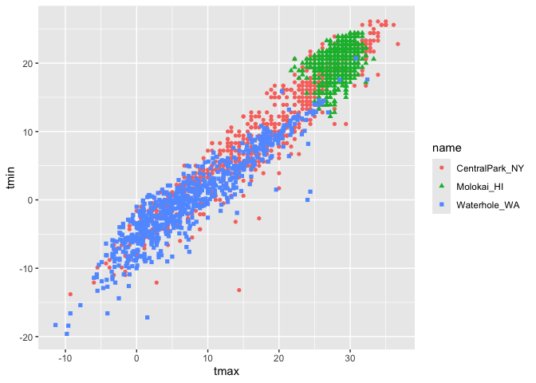
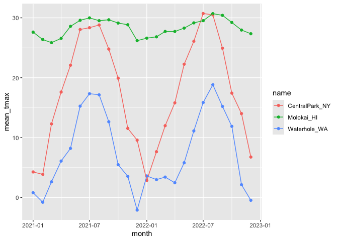
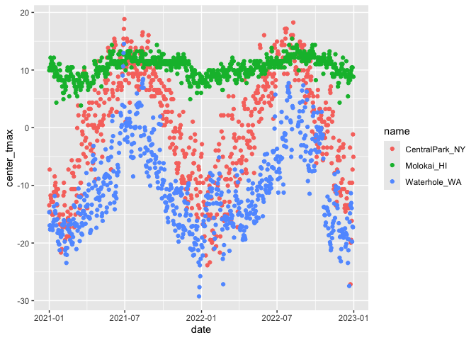

20261008_visualization
================
Hongtong Lin
2026-10-08

``` r
weather_df |> 
  filter(prcp >0) |> 
  ggplot(aes(x = prcp)) + 
  geom_histogram()
```

    ## `stat_bin()` using `bins = 30`. Pick better value `binwidth`.

<!-- -->

Do I believe this value?

``` r
weather_df |> 
  ggplot(aes(x = tmax, y = tmin, color = name, shape = name)) + 
  geom_point()
```

    ## Warning: Removed 17 rows containing missing values or values outside the scale range
    ## (`geom_point()`).

<!-- -->

## group_by()

add some groups

``` r
weather_df <- 
  weather_df |> 
  mutate(
    month = lubridate::floor_date(date, unit = "month")
  ) # lowest value for each of the month

weather_df
```

    ## # A tibble: 2,190 × 7
    ##    name           id          date        prcp  tmax  tmin month     
    ##    <chr>          <chr>       <date>     <dbl> <dbl> <dbl> <date>    
    ##  1 CentralPark_NY USW00094728 2021-01-01   157   4.4   0.6 2021-01-01
    ##  2 CentralPark_NY USW00094728 2021-01-02    13  10.6   2.2 2021-01-01
    ##  3 CentralPark_NY USW00094728 2021-01-03    56   3.3   1.1 2021-01-01
    ##  4 CentralPark_NY USW00094728 2021-01-04     5   6.1   1.7 2021-01-01
    ##  5 CentralPark_NY USW00094728 2021-01-05     0   5.6   2.2 2021-01-01
    ##  6 CentralPark_NY USW00094728 2021-01-06     0   5     1.1 2021-01-01
    ##  7 CentralPark_NY USW00094728 2021-01-07     0   5    -1   2021-01-01
    ##  8 CentralPark_NY USW00094728 2021-01-08     0   2.8  -2.7 2021-01-01
    ##  9 CentralPark_NY USW00094728 2021-01-09     0   2.8  -4.3 2021-01-01
    ## 10 CentralPark_NY USW00094728 2021-01-10     0   5    -1.6 2021-01-01
    ## # ℹ 2,180 more rows

``` r
weather_df |> 
  group_by(name, month) # 3 names, 12 months, 2 years, multipled together = 72 groups
```

    ## # A tibble: 2,190 × 7
    ## # Groups:   name, month [72]
    ##    name           id          date        prcp  tmax  tmin month     
    ##    <chr>          <chr>       <date>     <dbl> <dbl> <dbl> <date>    
    ##  1 CentralPark_NY USW00094728 2021-01-01   157   4.4   0.6 2021-01-01
    ##  2 CentralPark_NY USW00094728 2021-01-02    13  10.6   2.2 2021-01-01
    ##  3 CentralPark_NY USW00094728 2021-01-03    56   3.3   1.1 2021-01-01
    ##  4 CentralPark_NY USW00094728 2021-01-04     5   6.1   1.7 2021-01-01
    ##  5 CentralPark_NY USW00094728 2021-01-05     0   5.6   2.2 2021-01-01
    ##  6 CentralPark_NY USW00094728 2021-01-06     0   5     1.1 2021-01-01
    ##  7 CentralPark_NY USW00094728 2021-01-07     0   5    -1   2021-01-01
    ##  8 CentralPark_NY USW00094728 2021-01-08     0   2.8  -2.7 2021-01-01
    ##  9 CentralPark_NY USW00094728 2021-01-09     0   2.8  -4.3 2021-01-01
    ## 10 CentralPark_NY USW00094728 2021-01-10     0   5    -1.6 2021-01-01
    ## # ℹ 2,180 more rows

## `summarize()`

``` r
weather_df |> 
  group_by(name) |> 
  summarise(count = n())
```

    ## # A tibble: 3 × 2
    ##   name           count
    ##   <chr>          <int>
    ## 1 CentralPark_NY   730
    ## 2 Molokai_HI       730
    ## 3 Waterhole_WA     730

``` r
weather_df |> 
  group_by(name, month) |> 
  summarise(count = n())
```

    ## `summarise()` has regrouped the output.
    ## ℹ Summaries were computed grouped by name and month.
    ## ℹ Output is grouped by name.
    ## ℹ Use `summarise(.groups = "drop_last")` to silence this message.
    ## ℹ Use `summarise(.by = c(name, month))` for per-operation grouping
    ##   (`?dplyr::dplyr_by`) instead.

    ## # A tibble: 72 × 3
    ## # Groups:   name [3]
    ##    name           month      count
    ##    <chr>          <date>     <int>
    ##  1 CentralPark_NY 2021-01-01    31
    ##  2 CentralPark_NY 2021-02-01    28
    ##  3 CentralPark_NY 2021-03-01    31
    ##  4 CentralPark_NY 2021-04-01    30
    ##  5 CentralPark_NY 2021-05-01    31
    ##  6 CentralPark_NY 2021-06-01    30
    ##  7 CentralPark_NY 2021-07-01    31
    ##  8 CentralPark_NY 2021-08-01    31
    ##  9 CentralPark_NY 2021-09-01    30
    ## 10 CentralPark_NY 2021-10-01    31
    ## # ℹ 62 more rows

``` r
weather_df |> 
  count(name) # instead of doing group_by and summarizing, it will automatically counting for you. 
```

    ## # A tibble: 3 × 2
    ##   name               n
    ##   <chr>          <int>
    ## 1 CentralPark_NY   730
    ## 2 Molokai_HI       730
    ## 3 Waterhole_WA     730

``` r
weather_df |> 
  group_by(month) |> 
  summarise(
    count = n(),
    n_days = n_distinct(date),
    )
```

    ## # A tibble: 24 × 3
    ##    month      count n_days
    ##    <date>     <int>  <int>
    ##  1 2021-01-01    93     31
    ##  2 2021-02-01    84     28
    ##  3 2021-03-01    93     31
    ##  4 2021-04-01    90     30
    ##  5 2021-05-01    93     31
    ##  6 2021-06-01    90     30
    ##  7 2021-07-01    93     31
    ##  8 2021-08-01    93     31
    ##  9 2021-09-01    90     30
    ## 10 2021-10-01    93     31
    ## # ℹ 14 more rows

``` r
weather_df |> 
  group_by(name) |> 
  summarise(
    mean_tmax = mean(tmax, na.rm = TRUE),
    median_tmax = median(tmax, na.rm = TRUE),
    sd_prcp = sd(prcp, na.rm = TRUE),
    q25_prcp = quantile(prcp, .25, na.rm = TRUE),
    q95_prcp = quantile(prcp, .95, na.rm = TRUE)
  ) |> 
  knitr::kable(digits = 2) # reader friendly, limit the signficance figures to be 2at max
```

| name           | mean_tmax | median_tmax | sd_prcp | q25_prcp | q95_prcp |
|:---------------|----------:|------------:|--------:|---------:|---------:|
| CentralPark_NY |     17.66 |        18.9 |  113.40 |        0 |      198 |
| Molokai_HI     |     28.32 |        28.3 |   63.24 |        0 |       41 |
| Waterhole_WA   |      7.38 |         6.1 |  110.81 |        0 |      279 |

``` r
weather_df |> 
  group_by(name) |> 
  summarise(
    mean_tmax = mean(tmax, na.rm = TRUE)
  ) |> 
  pivot_wider(
    names_from = name,
    values_from = mean_tmax
  ) # can make the table untidy to be reader friendly
```

    ## # A tibble: 1 × 3
    ##   CentralPark_NY Molokai_HI Waterhole_WA
    ##            <dbl>      <dbl>        <dbl>
    ## 1           17.7       28.3         7.38

what about doing this

``` r
weather_df |> 
  group_by(name, month) |> 
  summarise(
    mean_tmax = mean(tmax, na.rm = TRUE)
  ) |> 
  ggplot(aes(x =month, y= mean_tmax, color = name)) +
  geom_point() + 
  geom_line()
```

    ## `summarise()` has regrouped the output.
    ## ℹ Summaries were computed grouped by name and month.
    ## ℹ Output is grouped by name.
    ## ℹ Use `summarise(.groups = "drop_last")` to silence this message.
    ## ℹ Use `summarise(.by = c(name, month))` for per-operation grouping
    ##   (`?dplyr::dplyr_by`) instead.

<!-- -->

``` r
weather_df |> 
  mutate(
    center_tmax = tmax - mean(tmax, na.rm = TRUE)
  ) |> 
ggplot(aes(x= date, y = center_tmax, color = name))+
  geom_point()
```

    ## Warning: Removed 17 rows containing missing values or values outside the scale range
    ## (`geom_point()`).

<!-- -->

What about “window” functions?

Try to rank things

``` r
weather_df |> 
  group_by(name, month) |> 
  mutate(temp_rank = min_rank(tmax)) |> 
  filter(temp_rank <2)
```

    ## # A tibble: 92 × 8
    ## # Groups:   name, month [72]
    ##    name           id          date        prcp  tmax  tmin month      temp_rank
    ##    <chr>          <chr>       <date>     <dbl> <dbl> <dbl> <date>         <int>
    ##  1 CentralPark_NY USW00094728 2021-01-29     0  -3.8  -9.9 2021-01-01         1
    ##  2 CentralPark_NY USW00094728 2021-02-08     0  -1.6  -8.2 2021-02-01         1
    ##  3 CentralPark_NY USW00094728 2021-03-02     0   0.6  -6   2021-03-01         1
    ##  4 CentralPark_NY USW00094728 2021-04-02     0   3.9  -2.1 2021-04-01         1
    ##  5 CentralPark_NY USW00094728 2021-05-29   117  10.6   8.3 2021-05-01         1
    ##  6 CentralPark_NY USW00094728 2021-05-30   226  10.6   8.3 2021-05-01         1
    ##  7 CentralPark_NY USW00094728 2021-06-11     0  20.6  16.7 2021-06-01         1
    ##  8 CentralPark_NY USW00094728 2021-06-12     0  20.6  16.7 2021-06-01         1
    ##  9 CentralPark_NY USW00094728 2021-07-03    86  18.9  15   2021-07-01         1
    ## 10 CentralPark_NY USW00094728 2021-08-04     0  24.4  19.4 2021-08-01         1
    ## # ℹ 82 more rows

`lead` and `lag` functions\
the order of the data sets matters

``` r
weather_df |> 
  group_by(name) |> 
  mutate(
    lagged_tmax = lag(tmax) # Shift by 1 position (default)
    )
```

    ## # A tibble: 2,190 × 8
    ## # Groups:   name [3]
    ##    name           id         date        prcp  tmax  tmin month      lagged_tmax
    ##    <chr>          <chr>      <date>     <dbl> <dbl> <dbl> <date>           <dbl>
    ##  1 CentralPark_NY USW000947… 2021-01-01   157   4.4   0.6 2021-01-01        NA  
    ##  2 CentralPark_NY USW000947… 2021-01-02    13  10.6   2.2 2021-01-01         4.4
    ##  3 CentralPark_NY USW000947… 2021-01-03    56   3.3   1.1 2021-01-01        10.6
    ##  4 CentralPark_NY USW000947… 2021-01-04     5   6.1   1.7 2021-01-01         3.3
    ##  5 CentralPark_NY USW000947… 2021-01-05     0   5.6   2.2 2021-01-01         6.1
    ##  6 CentralPark_NY USW000947… 2021-01-06     0   5     1.1 2021-01-01         5.6
    ##  7 CentralPark_NY USW000947… 2021-01-07     0   5    -1   2021-01-01         5  
    ##  8 CentralPark_NY USW000947… 2021-01-08     0   2.8  -2.7 2021-01-01         5  
    ##  9 CentralPark_NY USW000947… 2021-01-09     0   2.8  -4.3 2021-01-01         2.8
    ## 10 CentralPark_NY USW000947… 2021-01-10     0   5    -1.6 2021-01-01         2.8
    ## # ℹ 2,180 more rows

``` r
weather_df |> 
  group_by(name) |> 
  mutate(
    lagged_tmax = lag(tmax, n = 3) # Shift by 3 positions
    )
```

    ## # A tibble: 2,190 × 8
    ## # Groups:   name [3]
    ##    name           id         date        prcp  tmax  tmin month      lagged_tmax
    ##    <chr>          <chr>      <date>     <dbl> <dbl> <dbl> <date>           <dbl>
    ##  1 CentralPark_NY USW000947… 2021-01-01   157   4.4   0.6 2021-01-01        NA  
    ##  2 CentralPark_NY USW000947… 2021-01-02    13  10.6   2.2 2021-01-01        NA  
    ##  3 CentralPark_NY USW000947… 2021-01-03    56   3.3   1.1 2021-01-01        NA  
    ##  4 CentralPark_NY USW000947… 2021-01-04     5   6.1   1.7 2021-01-01         4.4
    ##  5 CentralPark_NY USW000947… 2021-01-05     0   5.6   2.2 2021-01-01        10.6
    ##  6 CentralPark_NY USW000947… 2021-01-06     0   5     1.1 2021-01-01         3.3
    ##  7 CentralPark_NY USW000947… 2021-01-07     0   5    -1   2021-01-01         6.1
    ##  8 CentralPark_NY USW000947… 2021-01-08     0   2.8  -2.7 2021-01-01         5.6
    ##  9 CentralPark_NY USW000947… 2021-01-09     0   2.8  -4.3 2021-01-01         5  
    ## 10 CentralPark_NY USW000947… 2021-01-10     0   5    -1.6 2021-01-01         5  
    ## # ℹ 2,180 more rows

``` r
weather_df |> 
  group_by(name) |> 
  mutate(
    lagged_tmax = lag(tmax), # Shift by 3 positions
    temp_change = tmax - lagged_tmax
    ) |> 
  summarise(
    mean_temp_change = mean(temp_change, na.rm = TRUE),
    sd_temp_change = sd(temp_change, na.rm = TRUE)
  )
```

    ## # A tibble: 3 × 3
    ##   name           mean_temp_change sd_temp_change
    ##   <chr>                     <dbl>          <dbl>
    ## 1 CentralPark_NY         0.0115             4.43
    ## 2 Molokai_HI            -0.000688           1.24
    ## 3 Waterhole_WA          -0.00155            3.04

## revisit same samples

import, clean, tidy, etc the pulse data, and compute mean and median BDI
score at each visit

``` r
pulse_df <- haven::read_sas("data/public_pulse_data.sas7bdat") |> 
  janitor::clean_names() |> 
  pivot_longer(
    bdi_score_bl:bdi_score_12m,
    names_to = "visit",
    values_to = "bdi_score"
  ) |> 
  select(id, visit, everything()) |> 
  mutate(
    visit = replace(visit, visit == "bl", "00m")
  ) 
# |> 
#   str_remove(visit, "bdi_score_")

pulse_df |> 
  group_by(visit) |> 
  summarize(
    mean_bdi = mean(bdi_score, na.rm=TRUE),
    median_bdi = median(bdi_score, na.rm=TRUE)
    )
```

    ## # A tibble: 4 × 3
    ##   visit         mean_bdi median_bdi
    ##   <chr>            <dbl>      <dbl>
    ## 1 bdi_score_01m     6.05          4
    ## 2 bdi_score_06m     5.67          4
    ## 3 bdi_score_12m     6.10          4
    ## 4 bdi_score_bl      7.99          6

In the FAS data, compute mean outcome (ears only) across dose and
day_of_txl; show in a reader friendly table

``` r
pups_df <- 
  read_csv("data/FAS_pups.csv", skip = 3, na = c("NA", "", ".")) |> 
  janitor::clean_names() 
```

    ## Rows: 313 Columns: 6
    ## ── Column specification ────────────────────────────────────────────────────────
    ## Delimiter: ","
    ## chr (1): Litter Number
    ## dbl (5): Sex, PD ears, PD eyes, PD pivot, PD walk
    ## 
    ## ℹ Use `spec()` to retrieve the full column specification for this data.
    ## ℹ Specify the column types or set `show_col_types = FALSE` to quiet this message.

``` r
litter_df <-
  read_csv("data/FAS_litters.csv", na = c("NA", "", ".")) |> 
  janitor::clean_names() |> 
  separate(group, into = c("dose", "day_of_tx", 3))
```

    ## Rows: 49 Columns: 8
    ## ── Column specification ────────────────────────────────────────────────────────
    ## Delimiter: ","
    ## chr (2): Group, Litter Number
    ## dbl (6): GD0 weight, GD18 weight, GD of Birth, Pups born alive, Pups dead @ ...
    ## 
    ## ℹ Use `spec()` to retrieve the full column specification for this data.
    ## ℹ Specify the column types or set `show_col_types = FALSE` to quiet this message.

    ## Warning: Expected 3 pieces. Missing pieces filled with `NA` in 49 rows [1, 2, 3, 4, 5,
    ## 6, 7, 8, 9, 10, 11, 12, 13, 14, 15, 16, 17, 18, 19, 20, ...].

``` r
fas_df <- 
  left_join(pups_df, litter_df, by = "litter_number") |> 
  select(litter_number, dose, day_of_tx, everything())

fas_df |> 
  group_by(dose, day_of_tx) |> 
  summarise(
    mean_ears = mean(pd_ears, na.rm = TRUE)
  ) |> 
  pivot_wider(
    names_from = day_of_tx, 
    values_from = mean_ears
  )
```

    ## `summarise()` has regrouped the output.
    ## ℹ Summaries were computed grouped by dose and day_of_tx.
    ## ℹ Output is grouped by dose.
    ## ℹ Use `summarise(.groups = "drop_last")` to silence this message.
    ## ℹ Use `summarise(.by = c(dose, day_of_tx))` for per-operation grouping
    ##   (`?dplyr::dplyr_by`) instead.

    ## # A tibble: 7 × 2
    ## # Groups:   dose [7]
    ##   dose   `NA`
    ##   <chr> <dbl>
    ## 1 Con7   4.29
    ## 2 Con8   3.60
    ## 3 Low7   3.58
    ## 4 Low8   3.44
    ## 5 Mod7   3.83
    ## 6 Mod8   3.54
    ## 7 <NA>   3.11
