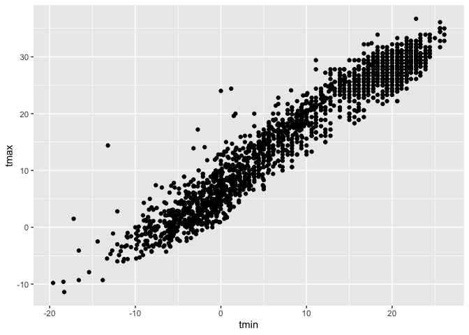
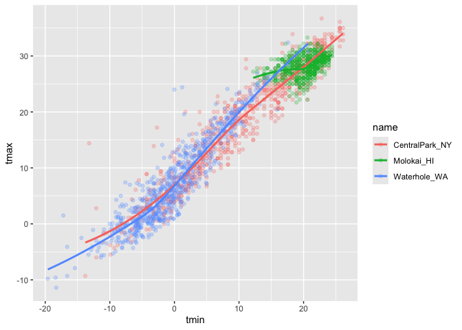

Visualization
================
Hongtong Lin
2026-10-01

loading libraries

``` r
library(tidyverse)
library(ggridges)

library(p8105.datasets)
data("weather_df")
```

``` r
dim(weather_df)
```

    ## [1] 2190    6

``` r
str(weather_df)
```

    ## spc_tbl_ [2,190 × 6] (S3: spec_tbl_df/tbl_df/tbl/data.frame)
    ##  $ name: chr [1:2190] "CentralPark_NY" "CentralPark_NY" "CentralPark_NY" "CentralPark_NY" ...
    ##  $ id  : chr [1:2190] "USW00094728" "USW00094728" "USW00094728" "USW00094728" ...
    ##  $ date: Date[1:2190], format: "2021-01-01" "2021-01-02" ...
    ##  $ prcp: num [1:2190] 157 13 56 5 0 0 0 0 0 0 ...
    ##  $ tmax: num [1:2190] 4.4 10.6 3.3 6.1 5.6 5 5 2.8 2.8 5 ...
    ##  $ tmin: num [1:2190] 0.6 2.2 1.1 1.7 2.2 1.1 -1 -2.7 -4.3 -1.6 ...
    ##  - attr(*, "spec")=
    ##   .. cols(
    ##   ..   name = col_character(),
    ##   ..   id = col_character(),
    ##   ..   date = col_date(format = ""),
    ##   ..   prcp = col_double(),
    ##   ..   tmax = col_double(),
    ##   ..   tmin = col_double()
    ##   .. )
    ##  - attr(*, "problems")=<pointer: 0x0>

``` r
head(weather_df)
```

    ## # A tibble: 6 × 6
    ##   name           id          date        prcp  tmax  tmin
    ##   <chr>          <chr>       <date>     <dbl> <dbl> <dbl>
    ## 1 CentralPark_NY USW00094728 2021-01-01   157   4.4   0.6
    ## 2 CentralPark_NY USW00094728 2021-01-02    13  10.6   2.2
    ## 3 CentralPark_NY USW00094728 2021-01-03    56   3.3   1.1
    ## 4 CentralPark_NY USW00094728 2021-01-04     5   6.1   1.7
    ## 5 CentralPark_NY USW00094728 2021-01-05     0   5.6   2.2
    ## 6 CentralPark_NY USW00094728 2021-01-06     0   5     1.1

``` r
colnames(weather_df)
```

    ## [1] "name" "id"   "date" "prcp" "tmax" "tmin"

Let’s make some scatterplots

``` r
ggplot(weather_df, aes(x = tmin, y=tmax)) +
  geom_point()
```

    ## Warning: Removed 17 rows containing missing values or values outside the scale range
    ## (`geom_point()`).

<!-- -->

do the data frame first

``` r
gg_temp_scatterplot <-
  weather_df |> 
    ggplot(aes(x = tmin, y=tmax)) +
    geom_point()

gg_temp_scatterplot
```

    ## Warning: Removed 17 rows containing missing values or values outside the scale range
    ## (`geom_point()`).

<!-- -->

make it a bit fancier

``` r
weather_df |> 
  ggplot(aes(x = tmin, y=tmax, color = name)) +
  geom_point(alpha = .25) +
  geom_smooth(se=FALSE)
```

    ## `geom_smooth()` using method = 'loess' and formula = 'y ~ x'

    ## Warning: Removed 17 rows containing non-finite outside the scale range
    ## (`stat_smooth()`).

    ## Warning: Removed 17 rows containing missing values or values outside the scale range
    ## (`geom_point()`).

<!-- -->

Show faceting

``` r
weather_df |> 
  ggplot(aes(x = tmin, y = tmax, color = name)) + 
  geom_point(alpha = 0.5) +
  facet_grid(. ~name) # rows ~ columns, and the period is a placeholder meaning "don't split by anything in this dimension." period can be ommitted here.
```

    ## Warning: Removed 17 rows containing missing values or values outside the scale range
    ## (`geom_point()`).

<!-- -->

``` r
weather_df |> 
  ggplot(aes(x = tmin, y = tmax, color = name)) + 
  geom_point(alpha = 0.5) +
  facet_grid(col = vars(name)) # newer, more explicit syntax. "Make a grid of panels where the columns come from the name variable."
```

    ## Warning: Removed 17 rows containing missing values or values outside the scale range
    ## (`geom_point()`).

<!-- -->

Look at sth else

``` r
weather_df |> 
  ggplot(aes(x = date, y = tmax, color = name)) +
  geom_point(aes(size = prcp), alpha = .5) +
  geom_smooth(se = FALSE) #se=FALSE means not showing confident level, se=true by default
```

    ## `geom_smooth()` using method = 'loess' and formula = 'y ~ x'

    ## Warning: Removed 17 rows containing non-finite outside the scale range
    ## (`stat_smooth()`).

    ## Warning: Removed 19 rows containing missing values or values outside the scale range
    ## (`geom_point()`).

<!-- -->

``` r
  facet_grid(. ~ name)
```

    ## <ggproto object: Class FacetGrid, Facet, gg>
    ##     attach_axes: function
    ##     attach_strips: function
    ##     compute_layout: function
    ##     draw_back: function
    ##     draw_front: function
    ##     draw_labels: function
    ##     draw_panel_content: function
    ##     draw_panels: function
    ##     finish_data: function
    ##     format_strip_labels: function
    ##     init_gtable: function
    ##     init_scales: function
    ##     map_data: function
    ##     params: list
    ##     set_panel_size: function
    ##     setup_data: function
    ##     setup_panel_params: function
    ##     setup_params: function
    ##     shrink: TRUE
    ##     train_scales: function
    ##     vars: function
    ##     super:  <ggproto object: Class FacetGrid, Facet, gg>

make a plot of central park tmax vs tmin only, and convert temperatures
from celcius to farenheit.

``` r
weather_df |> 
  filter(name == "CentralPark_NY") |> 
  mutate(
    tmin = tmin*(9/5)+32,
    tmax = tmax*(9/5)+32
  ) |> 
  ggplot(aes(x = tmin, y = tmax)) + 
  geom_point()
```

<!-- -->
